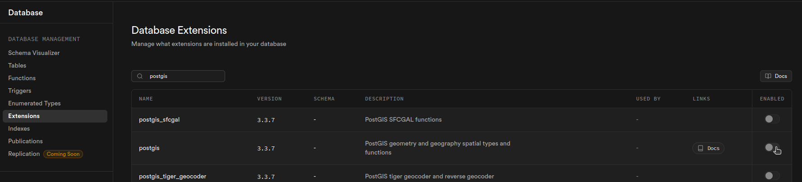

# HireHive

*Hyperlocal job board - Helping neighbors to help each other*.

@timboinspace 2025


## Problem

I wanted a way to organize the folks around the neighborhood that wanted to *do jobs*. Where I live, there are simultaneously:

- lots of jobs for people to do 
- lots of people that want to do jobs

Unfortunately, it's too disorganized - very few jobs actually get done. *It's a perfect opportunity to organize a market!* :thumbsup:


## Overview

HireHive seeks to match workers to jobs, **with as little friction as possible**. It's meant to be used in a **highly local context**: mowing a neighbor's lawn, taking out someone else's recycling bins, etc - all those small jobs to help each other out. 

> #### :x: Payment Processing
>
> The platform does not handle payment processing. Instead, it provides convenient avenues for users to choose whichever third-party service works for them. 


## Configuration

### Supabase

Create a new project and database. Be sure to include the Data API when configuring it initially. 

Immediately after configuring the DB, go **enable** **the** **`postgis`** extension. Enable it for the `public` schema when prompted:



Run this through the SQL Editor after:

```postgresql
-- We need to avoid a relationship loop. We can avoid setting a FK 
-- relationship to the `employer_locations` for now, then add it back later.
CREATE TABLE IF NOT EXISTS profiles (
    id uuid references auth.users on delete cascade primary key,
    username text unique,
    role text, -- 'worker', 'employer', or null
    tools text,
    specialties text,
    primary_location uuid, -- temporarily avoid FK constraint
    default_rate numeric,
    building_type text,
    created_at timestamptz default now()
);

-- Now do the rest of the schema
CREATE TABLE IF NOT EXISTS employer_locations (
  id uuid NOT NULL DEFAULT gen_random_uuid(),
  owner uuid,
  address text,
  geo USER-DEFINED,
  created_at timestamp with time zone DEFAULT now(),
  CONSTRAINT employer_locations_pkey PRIMARY KEY (id),
  CONSTRAINT employer_locations_owner_fkey FOREIGN KEY (owner) REFERENCES public.profiles(id)
);

CREATE TABLE IF NOT EXISTS jobs (
  id uuid NOT NULL DEFAULT gen_random_uuid(),
  employer_id uuid,
  title text NOT NULL,
  description text,
  location uuid,
  compensation numeric,
  payment_method text,
  approx_duration text,
  due_by timestamp with time zone,
  work_within tstzrange,
  tools text,
  claimed_by uuid,
  completed_by_worker boolean DEFAULT false,
  completed_by_employer boolean DEFAULT false,
  created_at timestamp with time zone DEFAULT now(),
  claimed_at timestamp with time zone,
  CONSTRAINT jobs_pkey PRIMARY KEY (id),
  CONSTRAINT jobs_employer_id_fkey FOREIGN KEY (employer_id) REFERENCES public.profiles(id),
  CONSTRAINT jobs_location_fkey FOREIGN KEY (location) REFERENCES public.employer_locations(id),
  CONSTRAINT jobs_claimed_by_fkey FOREIGN KEY (claimed_by) REFERENCES public.profiles(id)
);

CREATE TABLE IF NOT EXISTS ratings (
  id uuid NOT NULL DEFAULT gen_random_uuid(),
  job_id uuid,
  worker_id uuid,
  employer_id uuid,
  job_rating integer CHECK (job_rating >= 1 AND job_rating <= 5),
  worker_rating integer CHECK (worker_rating >= 1 AND worker_rating <= 5),
  created_at timestamp with time zone DEFAULT now(),
  CONSTRAINT ratings_pkey PRIMARY KEY (id),
  CONSTRAINT ratings_job_id_fkey FOREIGN KEY (job_id) REFERENCES public.jobs(id),
  CONSTRAINT ratings_worker_id_fkey FOREIGN KEY (worker_id) REFERENCES public.profiles(id),
  CONSTRAINT ratings_employer_id_fkey FOREIGN KEY (employer_id) REFERENCES public.profiles(id)
);

CREATE TABLE IF NOT EXISTS public.spatial_ref_sys (
  srid integer NOT NULL CHECK (srid > 0 AND srid <= 998999),
  auth_name character varying,
  auth_srid integer,
  srtext character varying,
  proj4text character varying,
  CONSTRAINT spatial_ref_sys_pkey PRIMARY KEY (srid)
);

-- Lastly, add the FK constraint back in
alter table profiles
add constraint fk_primary_location
foreign key (primary_location) references employer_locations(id);
```

To perform a server-side calculation of distance between locations, we can define a **custom function** in supabase. We're expecting the user's location as lat/long (that's how we get it from the browser location services) and need to compare to locations stored in well known binary format (WKBF).

> **Why be so careful with this?** :thinking:
>
> It would have been much, much easier to write the app so that the clients query *all future jobs* regardless of distance, then filter by a distance calculation. 
>
> That would have been some pretty easy javascript, but would have led to **sensitive data exposure**: a user could jank the client-side code to just see *all jobs regardless of distance* (privacy violation: users shouldnt be able to see jobs that arent relevant to them, ex. because of distance)

The lat/lon that we get from the browser is actually really, really rough. Mine only gets a location 350km from here... As a result, we set a very wide limit on how "wide" the range can be (500km):

```
create or replace function get_nearby_jobs(
    user_lon double precision,
    user_lat double precision,
    max_distance double precision
)
returns table (
    distance_m double precision,
    -- include all job columns automatically
    job_id uuid,
    employer_id uuid,
    title text,
    description text,
    location uuid,
    compensation numeric,
    payment_method text,
    approx_duration text,
    due_by timestamp with time zone,
    work_within tstzrange,
    tools text,
    claimed_by uuid,
    completed_by_worker boolean,
    completed_by_employer boolean,
    created_at timestamp with time zone,
    claimed_at timestamp with time zone
)
language sql as $$
  select
    ST_Distance(
      el.geo,
      ST_SetSRID(ST_MakePoint(user_lon, user_lat), 4326)::geography
    ) as distance_m,
    j.id as job_id,
    j.employer_id,
    j.title,
    j.description,
    j.location,
    j.compensation,
    j.payment_method,
    j.approx_duration,
    j.due_by,
    j.work_within,
    j.tools,
    j.claimed_by,
    j.completed_by_worker,
    j.completed_by_employer,
    j.created_at,
    j.claimed_at
  from jobs j
  join employer_locations el
    on j.location = el.id
  where ST_DWithin(
      el.geo,
      ST_SetSRID(ST_MakePoint(user_lon, user_lat), 4326)::geography,
      LEAST(max_distance, 500000)
  )
  order by distance_m;
$$;
```

I didn't want to do this kind of thing, since I like to allow people to freely use VPNs. However this is one of those apps that connects cyberspace to meetspace, so we need to depend on an accurate location...


## TO-DO

- [ ] index page should be more like a homepage
- [ ] Why is the profile button there?
- [ ] Acknowledge email verification in a more sensible way
- [ ] Add location_text to the locations table
