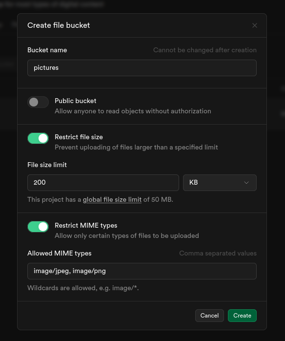

# HireHive

*Hyperlocal job board - Helping neighbors to help each other*.

@timboinspace 2025


## Problem

I wanted a way to organize the folks around the neighborhood that wanted to *do jobs*. Where I live, there are simultaneously:

- lots of jobs for people to do 
- lots of people that want to do jobs

Unfortunately, it's too disorganized - very few jobs actually get done. *It's a perfect opportunity to organize a market!* :thumbsup:


## Overview

HireHive seeks to match workers to jobs, **with as little friction as possible**. It's meant to be used in a **highly local context**: mowing a neighbor's lawn, taking out someone else's recycling bins, etc - all those small jobs to help each other out. 

> #### :x: Payment Processing
>
> The platform does not handle payment processing. Instead, it provides convenient avenues for users to choose whichever third-party service works for them. 


## Configuration

### Supabase

Create a new project and database. Be sure to include the Data API when configuring it initially. 

Immediately after configuring the DB, go **enable** **the** **`postgis`** extension. Enable it for the `public` schema when prompted:


Run this through the SQL Editor after:

```postgresql
CREATE TABLE IF NOT EXISTS profiles (
    id uuid references auth.users on delete cascade primary key,
    username text unique,
    role text, -- 'worker', 'employer', or null
    tools text,
    specialties text,
    default_rate numeric, -- default hourly rate, as worker or employer
    avatar_url text, -- permalink of supabase storage object for their profile pic
    external_link text, -- optional, a url to post on their page. Could be social or whatever, idc :(
    profile_data jsonb, -- a catch-all for other profile stuff
    created_at timestamptz default now()
);

CREATE TABLE IF NOT EXISTS locations (
  id uuid primary key default gen_random_uuid(),
  owner uuid references profiles(id) on delete cascade,
  is_favourite bool,
  address text,
  building_type text,
  geo geometry(Point, 4326),
  created_at timestamp with time zone DEFAULT now()
);

CREATE TABLE IF NOT EXISTS jobs (
  id uuid primary key default gen_random_uuid(),
  employer_id uuid references profiles(id) on delete cascade,
  created_at timestamptz default now(),
  title text not null,
  description text,
  location uuid references locations(id) on delete cascade,
  compensation_amount numeric,
  compensation_unit text,
  payment_method text,
  approx_duration text,
  due_by timestamptz,
  work_within tstzrange,
  tools text,
  claimed_by uuid references profiles(id),
  claimed_at timestamptz,
  completed_by uuid references profiles(id),
  completed_at timestamptz,
  confirmed_by uuid references profiles(id),
  confirmed_at timestamptz,
  rating_by_employer uuid, -- Avoid circular FK relationship for now, then add it back later.
  rating_by_worker uuid -- Avoid circular FK relationship for now, then add it back later.
);

CREATE TABLE IF NOT EXISTS tags (
    label text PRIMARY KEY,
    description text,
    icon text, -- bootstrap icon class name (without the "bi-" prefix below for clarity)
    applies_to text CHECK (applies_to IN ('employer', 'worker', 'either'))
);

INSERT INTO tags (label, description, icon, applies_to)
VALUES
    ('Fast', 'Works really fast and meets deadlines efficiently', 'lightning', 'worker'),
    ('Friendly', 'A pleasant person to help or hire', 'emoji-smile', 'either'),
    ('Reliable', 'Shows up on time and follows through consistently', 'check-circle', 'worker'),
    ('Organized', 'Keeps tasks and communications well-structured', 'calendar-check', 'either'),
    ('Great Communication', 'Communicates clearly and promptly', 'chat-dots', 'either'),
    ('High Quality', 'Delivered top-quality work or materials', 'star-fill', 'worker'),
    ('Professional', 'Maintains a respectful and professional attitude', 'briefcase', 'either'),
    ('Supportive', 'Encouraging and collaborative to work with', 'hand-thumbs-up', 'employer'),
    ('Good Instructions', 'Gave clear and detailed job expectations', 'info-circle', 'employer'),
    ('Punctual Payment', 'Paid promptly and without issue', 'cash-stack', 'employer'),
    ('Patient', 'Takes time to explain or accommodate changes', 'hourglass-split', 'either'),
    ('Team Player', 'Works well with others and contributes positively', 'people-fill', 'worker'),
    ('Detail Oriented', 'Pays close attention to details and quality', 'zoom-in', 'worker');

CREATE TABLE IF NOT EXISTS ratings (
  id uuid PRIMARY KEY DEFAULT gen_random_uuid(),
  submitted_by uuid REFERENCES profiles(id),
  job_id uuid REFERENCES jobs(id) on delete cascade,
  worker_id uuid REFERENCES profiles(id),
  employer_id uuid REFERENCES profiles(id),
  rating integer CHECK (rating >= 1 AND rating <= 10),
  created_at timestamptz DEFAULT now()
);

-- Linking table: a rating can have multiple tags
CREATE TABLE IF NOT EXISTS rating_tags (
    rating_id uuid NOT NULL REFERENCES ratings(id) ON DELETE CASCADE,
    tag_label text NOT NULL REFERENCES tags(label) ON DELETE CASCADE,
    PRIMARY KEY (rating_id, tag_label)
);

CREATE TABLE IF NOT EXISTS public.spatial_ref_sys (
  srid integer NOT NULL CHECK (srid > 0 AND srid <= 998999),
  auth_name character varying,
  auth_srid integer,
  srtext character varying,
  proj4text character varying,
  CONSTRAINT spatial_ref_sys_pkey PRIMARY KEY (srid)
);

-- Lastly, add the circular FK constraints back in
alter table jobs
add constraint fk_job_employer_rating
foreign key (rating_by_employer) references ratings(id);

alter table jobs
add constraint fk_job_worker_rating
foreign key (rating_by_worker) references ratings(id);
```

To perform a server-side calculation of distance between locations, we can define a **custom function** in supabase. We're expecting the user's location as lat/long (that's how we get it from the browser location services) and need to compare to locations stored in well known binary format (WKBF).

> **Why be so careful with this?** :thinking:
>
> It would have been much, much easier to write the app so that the clients query *all future jobs* regardless of distance, then filter by a distance calculation. 
>
> That would have been some pretty easy javascript, but would have led to **sensitive data exposure**: a user could jank the client-side code to just see *all jobs regardless of distance* (privacy violation: users shouldnt be able to see jobs that arent relevant to them, ex. because of distance)

The lat/lon that we get from the browser is actually really, really rough. Mine only gets a location 350km from here... As a result, we set a very wide limit on how "wide" the range can be (500km):

```postgresql
DROP FUNCTION get_nearby_jobs(double precision,double precision,double precision);
create or replace function get_nearby_jobs(
    user_lon double precision,
    user_lat double precision,
    max_distance double precision
)
returns table (
    distance_m double precision,
    lon double precision,
    lat double precision,
    -- include all job columns automatically
    job_id uuid,
    employer_id uuid,
    created_at timestamptz,
    title text,
    description text,
    location uuid,
    compensation_amount numeric,
    compensation_unit text,
    payment_method text,
    approx_duration text,
    due_by timestamptz,
    work_within tstzrange,
    tools text,
    claimed_by uuid,
    claimed_at timestamptz,
    completed_by uuid,
    completed_at timestamptz,
    confirmed_by uuid,
    confirmed_at timestamptz,
    rating_by_employer uuid,
    rating_by_worker uuid
)
language sql as $$
  select
    ST_Distance(
      el.geo,
      ST_SetSRID(ST_MakePoint(user_lon, user_lat), 4326)::geography
    ) as distance_m,
    ST_X(el.geo::geometry) AS lon,
    ST_Y(el.geo::geometry) AS lat,
    j.id as job_id,
    j.employer_id,
    j.created_at,
    j.title,
    j.description,
    j.location,
    j.compensation_amount,
    j.compensation_unit,
    j.payment_method,
    j.approx_duration,
    j.due_by,
    j.work_within,
    j.tools,
    j.claimed_by,
    j.claimed_at,
    j.completed_by,
    j.completed_at,
    j.confirmed_by,
    j.confirmed_at,
    j.rating_by_employer,
    j.rating_by_worker
  from jobs j
  join locations el
    on j.location = el.id
  where ST_DWithin(
      el.geo,
      ST_SetSRID(ST_MakePoint(user_lon, user_lat), 4326)::geography,
      LEAST(max_distance, 500000)
  )
  order by distance_m;
$$;
```


We also need a place to store users' profile pictures. We will also use Supabase for this, but not as a *blob*: we will use the **Storage bucket** feature of Supabase, then just name the files according to user ids.

In Supabase, go to *Storage* then click the *New Bucket* button: Make sure to set it as **Public**, which i havent done in the image below. This allows public reads but still requires auth for writes... 

> Basically, this is what we need to do if we'd like to use Supabase instead of a filesystem for avatars.



Now pop into the SQL editor, and submit these policies:

```postgresql
-- Only authenticated user can read objects
CREATE POLICY "Allow authenticated users to read any avatar"
ON storage.objects
FOR SELECT
USING (auth.role() = 'authenticated');

-- Only the owner can delete or update their own object
CREATE POLICY "Owner can modify their own avatar"
ON storage.objects
FOR ALL
USING (auth.uid() = owner);
```

This implements row-level security on ***all storage objects***. If we need to store other things later, this should be revised.


## TO-DO

- [ ] index page should be more like a homepage
- [ ] Why is the profile button there?
- [ ] Acknowledge email verification in a more sensible way
- [ ] Add location_text to the locations table
